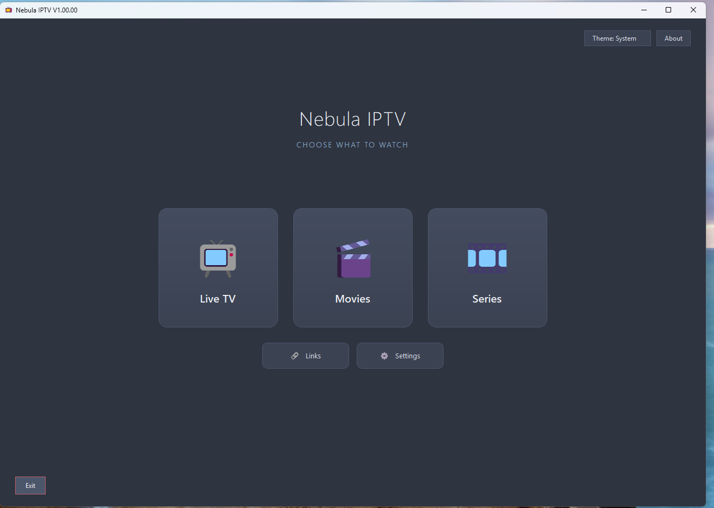
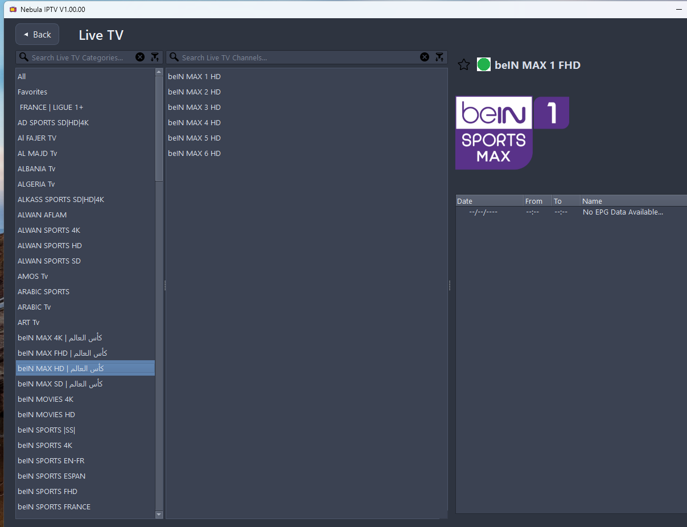
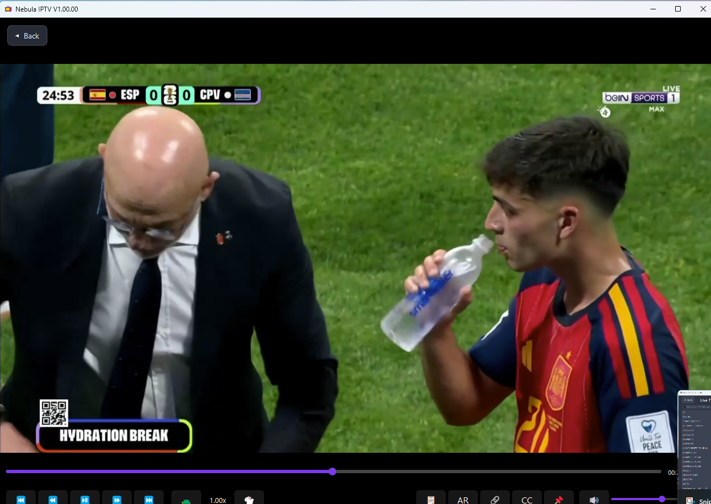
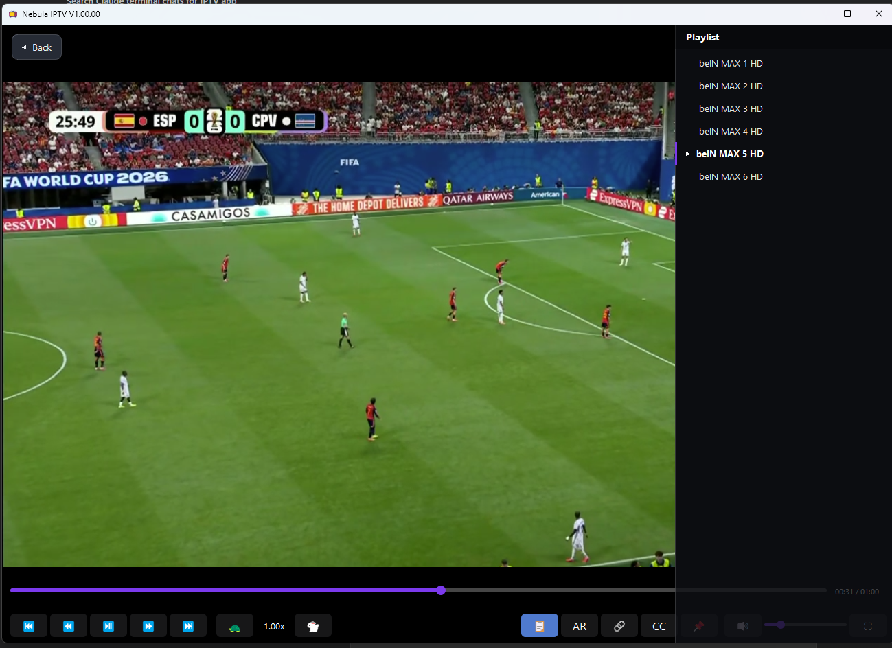

# Nebula IPTV Desktop

PyQt5 IPTV player with a **libvlc** decode backend and an opt-in **TV-mode UX** — the video fills the window as the background, and the channel browser slides in as a translucent overlay.

Forked from [V2 of Xtream-m3u_plus-IPTV-Player](https://github.com/Youri666/Xtream-m3u_plus-IPTV-Player). Working repo for the V3 redesign. See [`PLAN.md`](PLAN.md) for the architectural plan.

## Screenshots

| Home | Live TV |
|---|---|
|  |  |

| TV mode — playback | TV mode — sliding playlist |
|---|---|
|  |  |

## Status

| Phase | Status |
|---|---|
| 1. TV root + in-window video background | shipped |
| 2. Sliding translucent menu (hamburger + edge trigger + slide animation) | shipped |
| 3. In-window player controls overlay (seek, transport, volume, fullscreen) | shipped |
| 4. Polish — auto-close menu after channel pick | shipped |

Everything that was in V2 (internal player, bug fixes, theme switcher, Arabic / CP1256 EPG fallback, file logging) is still there. V3 mode is opt-in via Settings → "TV mode".

## Running

```bash
pip install -r requirements.txt   # PyQt5, requests, lxml, python-dateutil, python-vlc (optional)
python nebula_iptv.py
```

TV mode requires **libvlc** to be installed (the system VLC media player ships it). Without libvlc, classic V2 mode is used.

## Layout

### Classic mode (V2, still the default)

```
+----+------------+---------------+
|tabs|  channels  |  info pane    |   <- QTabWidget covering the whole window
+----+------------+---------------+
| progress bar                    |
+---------------------------------+
```

### TV mode (V3)

```
+---------------------------------------------+
|  [ menu ]                              -[]X |
|                                             |
|                                             |
|              [   video fills the   ]        |
|              [   whole window      ]        |
|                                             |
|                                             |
|    <<  <<  pp  >>  >>          vol===   fs  |   <- auto-hide overlay
+---------------------------------------------+

Click the menu button (or hover the left edge) -> menu slides in:

+----------+----------------------------------+
|  LIVE    |                                  |
|  Movies  |                                  |
|  Series  |   video still plays behind       |
|  Info    |   translucent menu               |
|  Settings|                                  |
+----------+----------------------------------+
```

## Keyboard shortcuts (TV view)

| Key | Action |
|---|---|
| `Ctrl+T` | Flip between Classic / TV view |
| `M`      | Toggle the sliding menu |
| `Space`  | Play / pause |
| `Left` / `Right` | Seek +/- 10 s |
| `Up` / `Down`    | Volume |
| Mouse wheel | Volume |
| Middle-click | Pause / resume |
| Double-click | Fullscreen toggle |
| `Esc`    | Exit fullscreen |

## What's planned next

- Slide-from-right Settings overlay (so settings doesn't live inside the menu)
- Picture-in-picture mode
- EPG overlay on top of the video (no need to switch views)
- Channel preview thumbnails in the sliding menu
- A non-frameless variant of TV mode for users who want native window decorations

## License

Inherited from the upstream project — GPL-3.0. See `LICENSE`.
